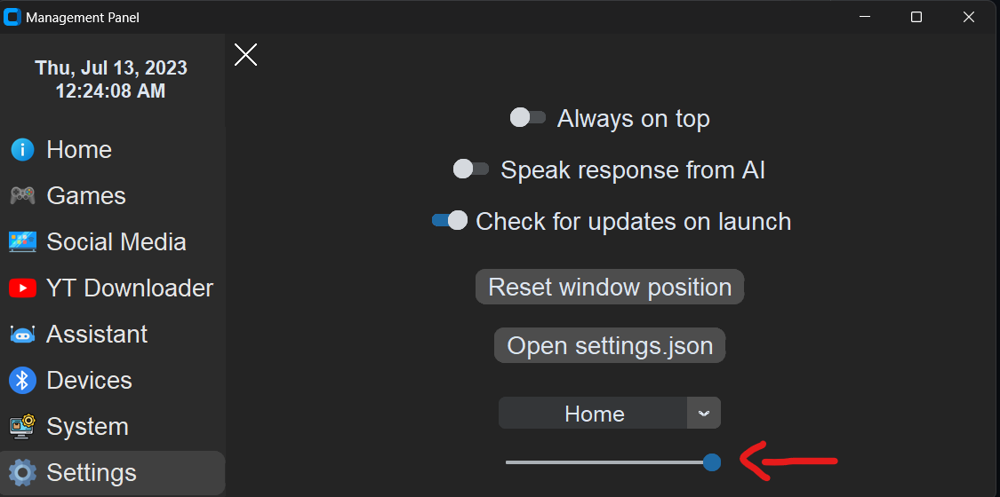
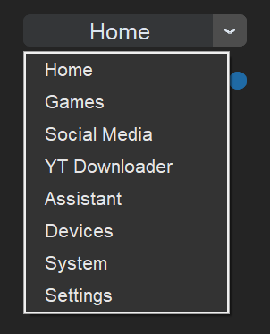
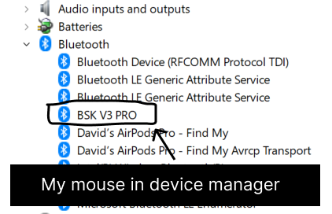

# Management_Panel

## App Information

**Version:** v4.1.7\
**Project status:** Ready for update/download\
**Last updated Github Repo:** 7/17/2023

## Setup

1. Make sure to have the latest version of [Python](https://www.python.org/downloads/). Python 3.9.0 or above is recommended.

2. Download the [Management_Panel source code](https://github.com/HyperNylium/Management_Panel/archive/refs/heads/main.zip) from GitHub.

3. Unzip the `Management_Panel-main.zip` file wherever you want.

4. Either run the `setup.bat` file which will install everything for you or install the required libraries from `requirements.txt` manually in your terminal.

5. Launch `Management_Panel.pyw` and have fun! 😄

## New with this update / Features

- App is fully responsive now.

- Made the navagation bar able to collapse and expand.

- Instead of the navagation bar title being "Management panel" now it displays the current date and time.\
The format changes accoreding to the navagation bar state to better fit the UI and elements (closed, open)\
and the time and date region stuff are pulled from your computer (a datetime library feature).

- Integrated YouTube downloader (audio and video).

- Integrated ChatGPT/OpenAI (you can change all of its settings in the `settings.json` file).

- After response is Received from ChatGPT/openai, if you have the **Speak response from AI** toggled, it will start to speak the responce to you

- Even if you are either downloading a file from YouTube or waiting for a response from ChatGPT, you can still switch through different tabs in the app. I wouldn't suggest this, but you can even change some settings from **settings.json**, and the thing would occasionally run (As I said, not recommended, but possible).

- You can directly change your power mode from the **System** tab. The dropdown will show you all available power modes, and the title of the dropdown will show you the active one (the mode that shows even when the dropdown is closed). Keep in mind, If you change the currently active power mode from control panel or anywhere else, the new values will **NOT** be reflected in the dropdown. You will have to restart the app for the dropdown to update. Also keep in mind that this dropdown is just selecting a powermode to be active. So, if you change the settings for a powermode (for example, Balanced now has a minimum CPU usage of 50% instead of 40%) the app will still work.


- Can change the alpha value of the window (transparency). The default value is 1.0 (no transparency).\
The minimum value is 0.4 (if you do put it at 0.0 then the app isn't visible anymore so limited it to 0.4).\
The maximum value is 1.0 (no transparency).\
You can change the value by going to the **Settings** tab and sliding the slider at the very bottom\
of the screen to your liking


- Can change the default launch tab from the default setting **Home** to whatever you want.\
You can change the value by going to the **Settings** tab and selecting the tab you want to be the default launch tab from the dropdown menu.\


- New devices tab. When you have a Bluetooth mouse, keyboard, or headset, simply go to the `settings.json` file and from the device manager in Windows under Bluetooth, find your device's name and put it in the `Devices` section like this:
```json
"Devices": [
  "YOUR DEVICE NAME",
  "BSK V3 PRO" // putting my own mouse name as an example.
] 
```


- Added a new event scheduling system. Instead of using the normal `.after()` or `.after_cancel()` methods, I made a new system that is more efficient and easier to use. To cancel a after even all you need is the function name that you want to cancel. Thats it.\
Heres an example of how to use it:
```python
import customtkinter

window = customtkinter.CTk()
after_events = {}

# The scehdule_create() function takes in the widget to assign,
# the time in milliseconds, the function you want to run,
# and any arguments you want to pass to the function (args (*) or kwargs (**)).
# The functions are saved in a dictionary with the function name as the key and the event id as the value
# so you can cancel the function by just using the function name as the parameter instead of the event id.
def schedule_create(widget, ms, func, cancel_after_finished=False, *args, **kwargs):
    event_id = widget.after(ms, lambda: func(*args, **kwargs))
    after_events[func.__name__] = event_id
    if cancel_after_finished:
        widget.after(ms, lambda: schedule_cancel(widget, func))
def schedule_cancel(widget, func):
    try:
        event_id = after_events.get(func.__name__)
        if event_id is not None:
            widget.after_cancel(event_id)
            del after_events[func.__name__]
    except: 
        pass

# This is the function that will be called after 5 seconds.
def test_func():
    print("test")

# Our test widget to assign the schedule to.
widget = customtkinter.label(window, text="test")
widget.pack()

# This will schedule the function to run after 5 seconds.
schedule_create(widget, 5000, test_func)

# You can also assign the main window widget if you want.
schedule_create(window, 5000, test_func)

# Then to cancel the function, all you need is the function name.
# No ID no nothing. Just the function name. Simple.
schedule_cancel(widget, test_func)
schedule_cancel(window, test_func)

# And instead of specifically cancalling the function, you can just set
# the cancel_after_finished parameter to True in the schedule_create() function.
# so that when x amount of milliseconds end (in our case 5000ms | 5 seconds) 
# the function will be canceled automatically and deleted from the dictionary.
# This is useful if you want to run the function only once. And the default value is False.
schedule_create(widget, 5000, test_func, cancel_after_finished=True)
schedule_cancel(window, test_func, cancel_after_finished=True)

window.mainloop()
```

- Implemented settings file called `settings.json`. When the app first launches, it creates the settings file using the default settings in the current working directory. Then, once created, it gets all settings by reading that file. You can open the file by going to\
`Settings > Open settings.json` in the app.
```json
// Default values for settings.json
{
  "URLs": {
      "WEBSITE": "http://hypernylium.com/",
      "GITHUBURL": "https://github.com/HyperNylium",
      "DISCORDURL": "https://discord.gg/4FHTjAgw95",
      "INSTAGRAMURL": "https://www.instagram.com/hypernylium/",
      "YOUTUBEURL": "https://www.youtube.com/channel/UCpJ4F4dMn_DIhtrCJwDUK2A",
      "TIKTOKURL": "https://www.tiktok.com/foryou?lang=en",
      "FACEBOOK": "https://www.facebook.com/HyperNylium/",
      "TWITTERURL": "https://twitter.com/HyperNylium"
  },
  "GameShortcutURLs": {
      "GAME_1": "",
      "GAME_2": "",
      "GAME_3": "",
      "GAME_4": "",
      "GAME_5": "",
      "GAME_6": "",
      "GAME_7": "",
      "GAME_8": "",
      "GAME_9": ""
  },
  "OpenAISettings": {
      "VoiceType": 0,
      "OpenAI_API_Key": "",
      "OpenAI_model_engine": "text-davinci-003",
      "OpenAI_Max_Tokens": 128,
      "OpenAI_Temperature": 0.5
  },
  "AppSettings": {
      "AlwaysOnTop": "False",
      "SpeakResponce": "False",
      "CheckForUpdatesOnLaunch": "True",
      "NavigationState": "open",
      "DownloadsFolderName": "YT_Downloads",
      "DefaultFrame": "Home",
      "Alpha": 1.0,
      "Window_State": "normal",
      "Window_Width": "",
      "Window_Height": "",
      "Window_X": "",
      "Window_Y": ""
  },
  "Devices": []
}
```

## Tested devices for "Devices" tab

|         Device          | Battery Data |
|:-----------------------:|:------------:|
| Razor Basilisk V3 Pro   |     Yes      |
| Airpods pro gen 2       |      No      |
> These are all the bluetooth devices I have, sorry...

## Things to keep in mind
- The program will automatically detect your computers desktop location (used for youtube downloader so all video/audio downloaded will be stored on your desktop directory instead of the current working directory that the file launched in)<br> For example: `C:\Users\[user]\Desktop\[DownloadsFolderName from settings.json]`

- All settings that you enable/disable/change will be stored in **settings.json**. If you delete that file, you will be reseting all your settings to default. So be careful.

- When opening your setting file from `Settings > Open settings.json` in the app, it will launch in your default text editor meaning if you setup **vs code** to open .json files, then it will launch in **vs code**

feel free to reach out if you have any questions or need further clarification 😉
